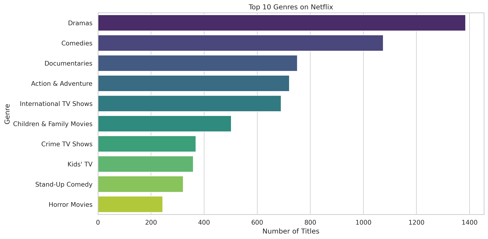

# Netflix Dataset Analysis 


## Project Overview
This project analyzes the Netflix dataset to uncover trends in content releases, genres, countries, and age groups. The goal is to provide **strategic insights** into Netflix's content distribution and viewing patterns. The analysis is performed using **Python**, **Pandas**, **Matplotlib**, **Seaborn**, and **Plotly**.

---

## Table of Contents
- [Dataset](#dataset)  
- [Features](#features)  
- [Data Cleaning & Feature Engineering](#data-cleaning--feature-engineering)  
- [Visualizations](#visualizations)  
- [Installation & Usage](#installation--usage)  
- [Folder Structure](#folder-structure)  
- [Author](#author)

---

## Dataset
The dataset used in this project contains Netflix content information, including:

- **Title** – Name of the content  
- **Category** – Movie or TV Show  
- **Director** – Director(s) of the content  
- **Cast** – Main cast  
- **Country** – Country of production  
- **Date Added / Release Date** – When the content was added  
- **Rating** – Age rating of the content  
- **Duration** – Duration of the content  
- **Type** – Genre or content type  

> Dataset file: `Netflix Dataset.csv`

---

## Features
- **Content Trends Analysis:** Movies vs TV Shows over the years  
- **Top Genres:** Identify the most popular genres  
- **Country-wise Analysis:** Content distribution across countries  
- **Age Group Classification:** Kids, Teens, Adults, Unrated  
- **Monthly & Weekly Release Patterns**  
- **WordCloud of Top Cast Members**  
- **Correlation Analysis:** Duration vs Release Year  
- **Interactive Choropleth Map** for country-wise content  

---

## Data Cleaning & Feature Engineering
- Converted `Release_Date` to datetime and extracted `Year`, `Month`, `Day`, and `Weekday`  
- Filled missing values for `Director`, `Cast`, `Country`, and `Rating`  
- Extracted `Main_Genre` from the Type column  
- Cleaned `Duration` into numeric (`Duration_Num`) and type (`Duration_Type`)  
- Classified content into `Age_Group` based on `Rating`  

---

## Visualizations
All plots are saved in the `plots/` folder. Key visualizations include:

1. **Movies vs TV Shows Released per Year**  
2. **Top 10 Genres on Netflix**  
3. **Stacked Bar – Movies vs TV Shows by Country (Top 10)**  
4. **Interactive Choropleth – Netflix Content by Country**  
5. **Trends of Popular Genres Over Time**  
6. **Content Release by Month & Day of Week**  
7. **WordCloud – Most Frequent Cast Members**  
8. **Correlation Matrix – Duration vs Year**  
9. **Distribution of Content by Age Group**  

> Example Plot:



---

## Installation & Usage
1. Clone this repository:
   ```bash
   git clone https://github.com/SonuKumar7065/VOIS_AICTE_Oct2025_MajorProject_SonuKumar.git
2. Navigate to the project folder:
   ```bash
   cd VOIS_AICTE_Oct2025_MajorProject_SonuKumar
3. Install required Python libraries:
    ```bash
    pip install pandas numpy matplotlib seaborn plotly wordcloud
4. Run the analysis script (or Jupyter Notebook):
   ```bash
   python Netflix_Analysis.py

##Author
Sonu Kumar
GitHub: https://github.com/SonuKumar7065
Contact: sonukumar7065@gmail.com


